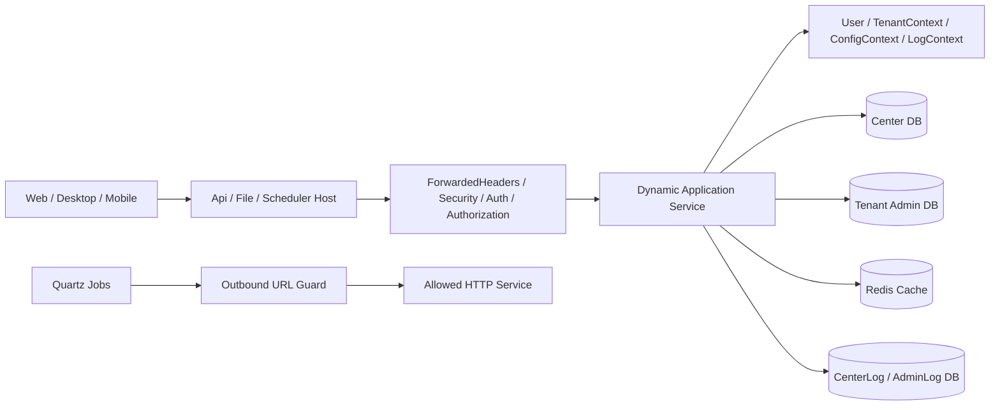

# Api.Server 系统级架构评审与优化报告

> 评审日期：2026-08-05  
> 评审范围：`Api.Server/src` 全部后端项目、宿主入口、领域实体、认证授权、租户上下文、缓存、日志、文件、调度及配置  
> 代码规模：20 个项目、475 个 C# 文件、约 56,422 行物理代码（2026-08-11 工作树统计，含注释和空行）
>
> 状态说明：本文是架构评审记录，不是生产发布证明。“已完成”状态已按 2026-08-11 实际代码复核；部署和迁移必须以 `DEPLOYMENT.md` 及生产迁移指南为准。

## 1. 执行摘要

Api.Server 已具备通用管理系统基础框架的主要骨架：平台中心库、租户业务库、日志库分离；账号与租户用户分离；RBAC、数据权限、动态 API、缓存、调度、文件服务等基础能力较完整。作为 OA、ERP、CMS 等系统的起点，模块覆盖度较好。

当前最大问题不是功能缺失，而是若干“安全边界依赖调用方自觉”的设计：租户过滤可被手动清除、数据权限由业务查询逐个调用、平台控制面只依赖按钮权限、授权缓存缺少统一撤销、账号状态变化只通知前端而未立即使令牌失效。原有租户二次登录和租户切换还存在直接认证绕过，属于不能带入生产的高风险问题。

本轮已直接完成一组兼容性可控的安全与架构修复：

- 封堵无密码租户登录和匿名跨租户切换。
- 建立统一授权会话撤销服务，账号禁用、租户禁用、职员停用、角色变更、密码修改/重置立即使缓存会话失效。
- 将新密码存储切换为 PBKDF2-SHA256；当前尚无旧 SHA1 自动迁移路径，属于生产上线阻断项。
- 增加系统租户平台控制面边界，普通租户无法访问全局账号、租户、数据库、应用、菜单、配置等接口。
- 修复可分配角色“空集合代表全部”的权限提升问题，并限制角色授权不得超出操作者已有权限。
- 统一保护 SignalR Hub，避免读取未经验证的 JWT。
- 对请求日志、异常日志、SQL 日志、差异日志和调度请求头进行敏感数据脱敏。
- 收紧匿名文件预览、图片解码与像素限制，恢复下载接口的租户过滤；匿名图片授权边界和完整路径约束仍待修复。
- 增加认证接口限流、HTTPS/HSTS 和安全错误响应；生产弱配置阻断与完整调度 SSRF 防护尚未实现。

结论：本轮修复后，框架的安全基线明显提高，关键认证绕过已消除；但要达到长期可运营的企业级基础框架标准，仍需继续完成刷新令牌会话化、跨库一致性、全资源数据授权、密码策略状态机、后台日志队列、索引治理和自动化测试。

## 2. 系统架构分析

### 2.1 项目与职责划分

| 层次 | 项目/模块 | 当前职责 | 评价 |
|---|---|---|---|
| 宿主 | `Fast.Api` | 核心管理 API、认证、SignalR | 主入口清晰 |
| 宿主 | `Fast.File` | 文件上传、下载、公开图片预览 | 独立部署合理，但公开资源模型原先不明确 |
| 宿主 | `Fast.Scheduler` | Quartz 调度宿主 | 与业务 API 分离合理 |
| 核心 | `Fast.Core` | 认证用户、租户/配置缓存、过滤器、异常、日志、种子数据、通用运行时能力 | 能力集中，但职责过重，已接近“基础设施大杂烩” |
| 领域 | `Center.*` | 平台级账号、租户、应用、菜单、数据库、文件、支付等 | 平台控制面和租户共享数据混合在同一边界 |
| 领域 | `Admin.*` | 每租户组织、职员、角色及业务配置 | 符合租户业务库定位 |
| 领域 | `CenterLog.*` / `AdminLog.*` | 平台与租户日志 | 物理隔离方向正确 |
| 服务 | `Fast.Center.Service` | 平台中心业务 | 部分服务过大，领域命令和查询混杂 |
| 服务 | `Fast.Admin.Service` | 租户管理业务 | 多处跨 Center/Admin 库手工事务 |
| 服务 | `Fast.Scheduler.Service` | 调度模型、作业、管理 API | URL 作业需要更强网络隔离 |
| 共享 | `Fast.Shared` | DTO 基类、枚举输出、公共特性 | 体量适中 |

### 2.2 请求与数据流

主要数据边界：

- `Account`：全局身份、密码、全局禁用状态和登录画像。
- `TenantUser`：账号在租户内的成员关系、租户内登录状态、职员快照。
- `Employee`：租户业务库中的 HR/组织职员主体。
- `Role/EmployeeRole/RoleMenu/RoleButton`：租户业务库 RBAC。
- `Menu/Button/Application/Config/Database`：Center 库平台控制面元数据。
- `IBaseTEntity`：Center 库共享表的租户过滤契约。

这种模型允许一个账号加入多个租户，方向正确；但 `Account`、`TenantUser`、`Employee` 的更新横跨两个数据库，现有代码无法提供真正的原子提交。

### 2.3 架构优点

- 三个宿主可独立伸缩，文件与调度不会直接拖慢核心 API。
- Center、Admin、Log、Gateway、Deploy 数据域有明确物理拆分。
- 账号与租户成员关系分离，天然支持一账号多租户。
- SqlSugar 查询总体使用表达式参数化，本轮未发现直接拼接用户输入形成 SQL 的明确注入点。
- RBAC 同时覆盖系统角色菜单、自定义角色菜单、按钮/API 权限及数据范围。
- 职员列表已经采用批量加载账号、角色，未发现该链路的典型逐行 N+1。
- 实体普遍包含行版本，具备乐观并发基础。
- 文件、调度、日志已有独立领域模型，后续可演进为空间存储、作业中心和审计中心。

### 2.4 主要架构缺陷

- 认证、租户、权限依赖缓存对象，原先没有统一撤销入口，状态变化与令牌有效性不一致。
- `ClearFilter<IBaseTEntity>()` 是高权限逃生口，缺少编译期或架构测试约束。
- 数据权限是查询扩展方法，不是资源授权策略，详情、修改、导出、删除容易漏用。
- Center/Admin 跨库操作使用两个本地事务顺序提交，第二次提交失败会产生永久不一致。
- `Fast.Core` 同时承担领域种子、运行时上下文、鉴权、日志、缓存和基础设施，耦合偏高。
- 多个 Service 超过合理职责范围，命令、查询、DTO 映射、审计、跨库协调混在单类中。
- 大量使用 `FastContext`/`RequestServices` 服务定位，依赖关系不透明，单元测试困难。
- 生产仍使用启动时 CodeFirst/种子思路，缺少可审计、可回滚、分环境的数据库版本管理。

## 3. 风险清单

| 编号 | 等级 | 问题 | 原因与影响 | 状态 |
|---|---|---|---|---|
| H-01 | 高 | 租户登录认证绕过 | 原 `/tenantLogin` 仅凭公开 Key 登录；原 `/tryLogin` 匿名且仅凭 UserKey | 已修复 |
| H-02 | 高 | 禁用/重置后旧 Token 继续可用 | 原实现只发 SignalR 消息，不清授权缓存 | 已修复 |
| H-03 | 高 | 普通租户可触达平台控制面 | 租户管理员菜单/按钮全量放行，接口缺少系统租户边界 | 已修复 |
| H-04 | 高 | 密码使用无盐 SHA1 保存 | 彩虹表、撞库和数据库泄露后的离线破解风险 | 已完成兼容迁移 |
| H-05 | 高 | 密码哈希与凭据进入 API/日志 | 密码历史 DTO 返回哈希，请求/SQL差异日志未脱敏 | 已修复 |
| H-06 | 高 | 匿名图片跨租户读取 | 公开预览仍按可猜测 FileId 查询图片，未建立公开目录或租户授权边界 | 待修复 |
| H-07 | 高 | 调度 URL SSRF 与机器人 Token 外发 | 当前只限制 HTTP/HTTPS 且禁止 URL 用户凭据，尚未校验解析后的目标网段或 Token 允许列表 | 部分修复 |
| H-08 | 高 | 仓库配置包含可复用凭据/弱默认值 | 部署复制配置时容易把示例密钥直接用于生产，当前没有 Production 启动阻断 | 待修复 |
| H-09 | 高 | 跨数据库双写不具备原子性 | Admin 与 Center 两个事务依次提交，无分布式事务/Outbox | 待架构演进 |
| H-10 | 高 | 数据权限覆盖不完整 | 依赖业务方法手工调用 `DataScope` | 职员/角色关键路径已补；其余待系统治理 |
| M-01 | 中 | RefreshToken 无服务端会话族 | 无持久化、轮换、复用检测、设备级吊销记录 | 待实现 |
| M-02 | 中 | 密码策略状态机不完整 | 无首次登录强制修改、密码有效期、策略版本；服务端看不到原始密码复杂度 | 待实现 |
| M-03 | 中 | 日志持久化可靠性 | SQL 日志已改为有界 Channel，但仍不是可恢复 Outbox，进程崩溃时队列内容可能丢失 | 部分修复 |
| M-04 | 中 | 权限缓存粒度与缓存治理不足 | 当前通过通配符撤销，缺少版本号、指标、雪崩/击穿治理 | 已保证正确性，性能治理待完成 |
| M-05 | 中 | 生产 CodeFirst 风险 | 启动期间隐式建表/变更，难审计、难灰度、难回滚 | 待迁移为版本化脚本 |
| M-06 | 中 | 关键关系缺少面向查询的索引 | `TenantUser`、在线会话、按 RoleId 反查职员等路径可能全表扫描 | 待基于执行计划生成 SQL |
| M-07 | 中 | 文件安全仍缺少恶意内容检测 | 已校验图片解码，但无病毒扫描、内容嗅探、隔离区、对象存储签名 URL | 待实现 |
| M-08 | 中 | 可观测性不足 | `/health` 已探测数据库和分布式缓存，但仍缺少队列状态、指标和追踪 | 部分修复 |
| M-09 | 中 | 超大服务与服务定位 | 修改半径大，难测试，跨库流程职责不清 | 待分阶段重构 |
| L-01 | 低 | Nullable 未启用 | 空值缺陷更多依赖运行时暴露 | 新模块先启用，存量渐进治理 |
| L-02 | 低 | 自动化测试缺失 | 当前解决方案没有测试项目，认证/租户回归成本高 | 待补充 |

## 4. 多租户设计评审

### 4.1 隔离模型

当前同时使用两种隔离方式：

1. Admin/AdminLog 按租户选择独立数据库连接。
2. Center 中共享实体通过 `IBaseTEntity.TenantId` 全局过滤。

混合模型适合基础框架，但必须把“平台控制面”和“租户数据面”作为两个明确安全域。原实现把 `_user.IsAdmin` 视为菜单/按钮全权限，而租户管理员同样可能为 `IsAdmin`，导致平台菜单和平台 API 的权限边界不清。

本轮新增 `PlatformOnlyAttribute + PlatformAccessFilter`：只有系统租户可以进入平台控制面；原有 `Permission` 仍负责系统租户内部的 RBAC。普通租户登录信息中同时移除了平台菜单及其按钮。以下全局能力已保护：账号、租户、数据库、应用标识、配置、API、商户、菜单、系统序号、字典模板、表格模板、密码历史，以及数据库初始化。

`ApplicationSelector`、租户自身选择器、匿名字典读取、用户个人表格配置等数据面接口仍保持原用途，不做一刀切封锁。

### 4.2 TenantId 传递与绕过

审计确认租户过滤主要依赖 SqlSugar AOP。所有 `ClearFilter<IBaseTEntity>()` 均应视为安全敏感代码。本轮保留的清除点都有显式收敛条件：

- 登录前按账号、UserKey 或工号定位租户成员。
- 已认证账号查询自己加入的租户。
- 会话撤销按账号/租户/职员定位。
- ChatHub 按已验证身份中的 TenantId 和 ConnectionId 定位。
- 系统租户文件管理、数据库管理的显式平台场景。

已修复 File、PayRecord、RefundRecord 的租户实体契约；文件下载恢复仓储租户过滤。匿名预览目前只限制为图片类型，仍未按 Logo、Avatar、Editor 等公开目录建立授权边界，证件照等图片仍需继续治理。

### 4.3 缓存与租户切换

- 修复 `TenantContext.DeleteAllTenant` 错用 Config 缓存键的问题。
- `/tryLogin` 现在必须已认证，且目标 `TenantUser.AccountId` 必须等于当前账号。
- 租户切换先撤销当前令牌/缓存，再签发目标租户会话。
- 租户禁用会撤销该租户所有应用、设备、职员缓存会话。

建议后续将缓存键从纯字符串通配符升级为 `SessionVersion`：账号、租户、职员、角色分别维护版本号，JWT/缓存携带版本快照。权限变化只需递增版本，避免 Redis `KEYS/Pattern delete` 在大规模租户下造成性能抖动。

### 4.4 跨库一致性

职员离职、绑定账号、编辑职员等流程同时更新 Admin 与 Center 数据库。两个 `BeginTran/CommitTran` 不是分布式事务：第一个库提交成功后第二个库失败，回滚无法恢复第一个提交。

推荐最佳实践：

- 将 `Account` 作为全局身份聚合，`TenantUser` 作为成员聚合，`Employee` 作为 HR 聚合。
- 单次请求只原子提交本地聚合和 Outbox 事件。
- 后台消费者幂等同步另一个数据库，使用业务幂等键、重试和死信表。
- 增加一致性巡检任务，对孤立 Account、TenantUser、Employee 和角色关系自动告警，不直接静默修复。

## 5. 账号与认证体系评审

### 5.1 Account / TenantUser / Employee 职责

推荐权威字段归属：

| 实体 | 权威职责 | 可保留快照 |
|---|---|---|
| Account | 手机/邮箱登录标识、密码、全局禁用、锁定、认证画像 | 昵称、头像 |
| TenantUser | 账号与租户成员关系、租户内登录状态、EmployeeId | 职员姓名、主部门展示快照 |
| Employee | 人事资料、组织关系、任职/离职生命周期 | 不保存认证密码和全局账号状态 |

现有方向基本符合，但同步依赖命令中手工回填。建议增加显式的“绑定、解绑、换绑、离职后保留账号、重新入职”状态机和审计事件，禁止直接修改外键模拟业务流程。

### 5.2 登录流程

已修复：

- `/tenantLogin` 必须重新验证密码，`AccountKey` 只作为一致性校验，不能作为凭据。
- `/tryLogin` 移除匿名访问，只允许同一 Account 的租户切换。
- 手机号不存在时不再空引用。
- 全局重复工号不再触发 `Single` 异常；存在歧义时要求使用手机号登录。
- 匿名登录、租户登录、微信登录及微信 Code 接口启用固定窗口限流。
- 锁定期在密码校验前检查，正确密码不能绕过锁定。
- 连续错误达到阈值时禁用账号并立即撤销会话。

### 5.3 Token 与会话

当前 AccessToken 的核心有效性依赖 Redis 中 `AuthUserInfo`，因此撤销缓存即可让后续 API 请求失效。本轮新增统一会话撤销并应用于：

- 账号禁用。
- 账号修改密码、重置密码。
- 租户禁用。
- 职员离职、租户内登录禁用。
- 职员角色变化、角色定义或授权变化。

同时向在线连接发送强制下线通知。ChatHub 现在要求认证，只读取认证中间件验证后的 Claims，不再自行解析未经验证的 JWT。

仍需新增服务端 Session/RefreshToken 表，至少包含：SessionId、TokenFamilyId、AccountId、TenantId、DeviceId、RefreshTokenHash、CreatedAt、ExpiresAt、RotatedAt、RevokedAt、RevokeReason、LastSeenIp。刷新时必须轮换 RefreshToken；旧 RefreshToken 再次出现时应吊销整个 TokenFamily。

### 5.4 密码安全

已完成：

- 新密码使用 210,000 次 PBKDF2-SHA256、16 字节随机盐、32 字节输出保存。
- 当前不兼容历史 SHA1 凭据；生产升级必须先部署兼容过渡版本或重置密码。
- 初始化账号、租户管理员、绑定账号、重置密码统一使用强哈希。
- 修改密码检查旧密码，并禁止复用最近 5 次密码。
- 密码历史 API 不再返回任何密码哈希。
- 修改或重置密码后撤销全部租户、设备会话。

尚未完整实现：

- 前端当前先对原始密码做 SHA1，服务端无法判断真实密码复杂度；必须通过 TLS 发送原始密码或使用标准 PAKE，再由服务端执行策略。
- 缺少 `MustChangePassword`、`PasswordChangedAt`、`PasswordExpiresAt`、`PasswordPolicyVersion`。
- 缺少首次登录强制修改、到期宽限、管理员重置后的临时凭据一次性使用。
- 缺少可配置锁定策略、验证码升级策略和异常登录风控。
- 缺少 MFA/Passkey。

## 6. 权限系统评审

### 6.1 RBAC

现有模型由 EmployeeRole、Role、RoleMenu、RoleButton 组成；后端 `Permission` 使用 ButtonCode，前端菜单和按钮也来自同一菜单/按钮注册表，基础模型合理。

原高风险问题是“可分配角色列表为空代表可分配全部”。这使普通授权管理员只要自身角色未配置 `AssignableRoleIds`，就能给他人分配任意角色。本轮改为安全默认：空集合代表不可分配任何角色。

本轮还增加：

- 普通用户只能查询、查看、编辑、删除、授权其可分配范围内的角色。
- 新建/编辑角色不能产生超出操作者 RoleType 或更宽的数据范围。
- 角色授权的 MenuIds/ButtonIds 必须是操作者已有权限的子集。
- 职员新增/编辑时角色分配采用同样的 fail-closed 规则。
- 角色或授权变化后撤销租户会话，避免旧权限缓存继续生效。

兼容性注意：历史上依赖“空列表=全部”的非管理员角色必须显式补齐可分配角色，否则升级后将无法分配角色。这是有意的安全收紧。

### 6.2 数据权限

`DataScopeExtension` 支持全部、本机构及以下、本部门及以下、本部门、本人，查询表达式总体合理。但它是可选扩展，无法保证每个资源接口都调用。

本轮为职员详情、编辑、状态、离职、绑定账号和登录状态补充与列表一致的数据范围校验。角色管理也增加委派范围校验。

长期方案应从“查询过滤”升级为“资源授权”：

- 定义 `IAuthorizationRequirement + IResourceAuthorizationService`。
- 每个命令先加载最小资源投影（TenantId、DepartmentId、OwnerId），统一校验后再执行。
- 列表、详情、导出、修改、删除复用同一授权表达式。
- 增加架构测试：带 `Permission` 的数据资源接口必须声明 DataScope/ResourcePolicy。
- 超级管理员只绕过业务权限，不绕过租户解析、审计和危险操作二次确认。

## 7. 安全评审

### 7.1 已完成加固

- 认证：修复密码绕过、匿名切换、锁定绕过、JWT Claim 空引用及认证错误泄露。
- 授权：新增平台控制面边界，机器/程序信息需平台 API 权限。
- WebSocket：Hub 加 `[Authorize]`，只使用已验证身份。
- 限流：认证接口按来源 IP 每分钟 30 次，超限返回 429。
- TLS：非开发环境启用 HSTS 和 HTTPS 重定向。
- 错误响应：非业务异常对客户端统一返回通用 500 信息，详细信息仅进服务端日志。
- 日志：密码、Token、Authorization、Cookie、连接字符串、密钥等字段脱敏；SQL 日志记录参数化原始 SQL，不再保存渲染后的完整值 SQL。
- 文件：公开预览已限制为图片；下载恢复租户过滤；图片必须可解码且不超过 4,000 万像素；响应增加 `nosniff`。公开目录授权边界和基于 `AppContext.BaseDirectory` 的路径约束仍需补齐。
- 调度：已限制为 HTTP/HTTPS 且禁止 URL 用户凭据；尚未阻断回环、链路本地、云元数据和其他私网目标，也未建立机器人 Token 的目标 Origin 允许列表。
- 生产启动：当前没有针对 JWT、数据库/Redis 弱密码、初始化密码、默认临时密码及 Swagger 状态的 fail-fast 校验，必须由部署前检查和密钥管理兜底。

### 7.2 未发现明确漏洞的领域

- SQL：业务查询主要使用 SqlSugar 表达式和参数，未发现直接把请求参数拼入 SQL 的明确路径。动态表名来自内部元数据，仍应限制为已注册表。
- CSRF：当前为 Authorization Header Bearer 模式，浏览器不会自动附带凭据，CSRF 风险较低；未来若改 Cookie/BFF 必须启用 SameSite、Origin 校验和 Anti-Forgery Token。
- XSS：匿名 HTML 预览已禁止；调度日志展示使用 HTML 编码。前端仍需保持 `v-html` 白名单和 CSP。

### 7.3 残余安全风险

- 调度 HTTP 工具可能自动跟随重定向，且校验与连接存在二次 DNS 解析窗口。下一步应使用专用 `HttpClientHandler`：禁用自动重定向、`ConnectCallback` 固定已校验 IP、限制响应体、端口和 DNS TTL。
- 文件只做图片解码，不包含杀毒、压缩炸弹扫描和 Office/PDF 主动内容检测。
- 当前 IP 限流依赖正确配置可信反向代理；必须限制 `KnownProxies/KnownNetworks`，不能信任任意转发头。
- 仓库历史中已有配置凭据必须轮换；当前没有启动校验可阻止弱配置继续部署，也不能撤销已经泄露的凭据。
- `AllowedHosts`、CORS、外部 IP 地理查询服务应按生产域名和隐私策略配置。

## 8. 性能与稳定性评审

### 8.1 数据库

优点：职员分页后的账号和角色采用批量查询；分页由数据库执行；更新普遍使用局部 SQL 或批量操作。

需优化：

- `TenantUser` 缺少面向 `(TenantId, AccountId)`、`AccountId`、`UserKey`、`(TenantId, EmployeeNo)` 查询的明确索引/唯一约束。
- `TenantOnlineUser` 应增加 `(TenantId, EmployeeId, IsOnline)`、`(AccountId, IsOnline)`、`ConnectionId` 索引。
- EmployeeRole 复合主键以 EmployeeId 为首列，按 RoleId 反查职员需要独立 RoleId 索引；RoleMenu/RoleButton 同理评估反向查询。
- 日志分表查询必须强制时间范围，避免跨全部分表扫描。
- 大数据分页不能长期依赖高 Offset，应为稳定排序列提供 Keyset/Cursor 分页。
- 索引必须基于真实慢 SQL、执行计划和基数验证，不能仅凭代码批量创建。

依据工作规范，本轮没有连接数据库、执行迁移或自动创建索引。建议另行生成 SQL Server/MySQL/PostgreSQL/Oracle/SQLite 各方言脚本，审核后人工执行。

### 8.2 缓存

- 当前上下文缓存减少中心表查询，但没有统一 TTL、命中率、加载耗时和容量指标。
- 通配符删除保证了安全正确性，但大键空间下成本不可控。
- 建议使用版本化缓存键、单飞加载、随机 TTL、负缓存和按租户容量限额。
- 严禁跨租户共享包含权限/配置的可变对象；缓存值必须带 TenantId 并在读取时断言一致。

### 8.3 日志与异步

请求、异常、SQL 日志使用 `Task.Run` 后台写库。该方式无背压、无关闭排空、无法统一重试。建议新增有界 `Channel<AuditEnvelope>`：

- 请求线程只入队；队列满时按日志等级降级或落本地磁盘。
- 单独 HostedService 批量写入并在停机时排空。
- 审计日志不能静默丢弃，失败进入 Outbox/死信。
- SQL 日志按慢查询阈值和采样记录，不应默认保存全部 SQL。

### 8.4 外部调用与启动

- 登录、上传时同步获取外网 IP 地理信息会增加尾延迟，应改为超时很短的异步旁路或日志消费端补全。
- 调度初始化按租户/作业循环加载，租户数量增长后应限并发、分批和惰性加载。
- CodeFirst/种子数据不应阻塞生产实例全部启动；迁移应作为独立发布步骤。

## 9. 代码质量与可维护性

本轮已修复跨请求静态状态：`GlobalContext.IsWeb/IsDesktop/IsMobile` 原为首次访问时初始化的静态字段，可能把第一个请求的设备类型泄漏到所有后续请求；现改为按当前上下文计算的属性。

建议重构顺序：

1. 将 LoginService 拆为 CredentialVerifier、LoginOrchestrator、TenantSelectionService、LoginAuditWriter。
2. 将 EmployeeService 的跨库操作拆为本地命令 + Outbox，而不是继续增加事务分支。
3. 将 AccountService 拆为 PasswordService、AccountLifecycleService、AccountQueryService。
4. 将静态 Context 逐步替换为显式注入接口，消除 `FastContext.HttpContext.RequestServices`。
5. 新增项目级 Nullable，先覆盖新增模块，再逐目录消除警告。
6. DTO 映射可保留手写，但查询投影与权限投影应形成可复用规范。
7. 对公共 API、租户过滤、权限策略和缓存键增加架构测试。

## 10. 本轮已完成的优化与新增能力

### 10.1 认证与账号

- PBKDF2-SHA256 密码哈希；历史 SHA1 自动迁移尚未实现。
- 最近 5 次密码历史校验。
- 统一会话撤销、全设备强制下线。
- 登录失败锁定顺序修复。
- 登录/微信认证限流。
- 安全的租户二次登录与已认证租户切换。
- 密码历史输出移除哈希。

### 10.2 多租户与权限

- 平台控制面标记与全局过滤器。
- 普通租户平台菜单/按钮过滤。
- 账号、租户、数据库、应用、配置等平台接口隔离。
- 角色委派 fail-closed、授权子集校验和权限变更会话失效。
- 职员详情及命令的数据范围校验。
- Tenant 全量缓存清理键修复。

### 10.3 安全与运维

- 生产安全配置启动校验尚未实现。
- HTTPS/HSTS。
- SignalR 认证。
- 敏感日志脱敏。
- 通用 500 错误隐藏内部实现。
- 文件下载租户过滤、图片解码与像素限制已实现；公开/私有目录边界和完整安全路径约束尚未实现。
- 调度仅完成协议和 URL 用户凭据限制；私网目标阻断和机器人凭据 Origin 允许列表尚未实现。
- 机器/程序运行信息改为平台权限访问。

## 11. 上线兼容性与配置要求

本轮包含必要的安全行为收紧：

- `/tenantLogin` 现在必须传密码；当前 Web.Admin 已传递密码，其他客户端需同步。
- `/tryLogin` 必须携带有效登录态，且只能切换同一 Account 下的租户。
- 普通租户访问平台全局接口将返回 403。
- 非管理员角色 `AssignableRoleIds` 为空时不再代表无限授权。
- 密码字段长度需容纳 PBKDF2 字符串；工作树中的实体长度已调整为 200。
- 历史 SHA1 密码不能由当前版本验证；上线前必须先部署兼容过渡版本，或安排强制重置密码。
- 非开发环境当前不会因安全配置不合格而拒绝启动；上线前必须单独完成配置审计。

生产环境至少应通过环境变量或密钥管理服务提供：

- `JWTSettings__IssuerSigningKey`：至少 48 字符的随机密钥，并轮换仓库历史中的旧密钥。
- 数据库和 Redis 凭据：不得使用示例值，禁止提交仓库。
- `SecuritySettings__InitialAdminPassword`：至少 12 位，包含大小写、数字、特殊字符。
- `SecuritySettings__DefaultAccountPassword`：同上，仅作为临时密码。
- 当前版本没有调度目标网段和机器人凭据 Origin 允许列表配置；在补齐代码前，不应允许不受信任用户编辑调度 URL 或机器人 Token。
- 非开发环境保持 `SwaggerSettings__Enable=false`。

## 12. 后续新增功能建议与路线图

### P0：下一安全版本

- 服务端 Session/RefreshToken 管理、轮换、复用检测、设备级吊销。
- 账号绑定/解绑/换绑状态机及跨库 Outbox。
- 全资源统一数据授权与架构测试。
- 生产密钥迁移至 Vault/KMS/云密钥服务并完成全量轮换。
- 调度专用 HttpClient，禁重定向、固定解析 IP、限端口/响应体。
- 身份、角色、租户、配置危险操作审计不可抵赖化。

### P1：企业管理能力

- 密码策略中心：复杂度、有效期、历史次数、锁定阈值、首次登录修改、策略版本。
- 安全中心：在线设备、会话列表、一键下线、登录风险、异常地点告警。
- TOTP/WebAuthn 2FA，平台超级管理员强制开启。
- 权限可视化：角色继承、菜单/按钮/API/数据范围差异和越权预警。
- Readiness/Liveness 分离，DB、Redis、日志队列、调度器健康检查。
- OpenTelemetry Trace/Metrics/Logs，慢 SQL、缓存命中率、租户资源使用量仪表板。

### P2：扩展与运维

- 后台任务统一控制台、幂等键、重试、死信、补偿和任务租户配额。
- 消息通知中心，统一站内信、邮件、短信、企业微信等渠道。
- API 租户级配额、并发限制、熔断和按业务 Key 的限流。
- 缓存管理中心，仅允许按命名空间/租户安全失效，禁止任意 Key 操作。
- 导入导出任务化、分片、进度、断点续传、模板版本和数据权限复用。
- 对象存储、私有 Bucket、短期签名 URL、病毒扫描和内容安全流水线。

## 13. 关键代码修改清单

| 范围 | 关键文件 |
|---|---|
| 宿主安全基线 | `src/Api/Program.cs`、`src/File/Program.cs`、`src/Scheduler/Program.cs`、`src/Domain/Core/coresettings.json` |
| 密码与生产配置 | `PasswordHasher.cs`、`SecurityConfigurationExtension.cs`、`SecurityPolicyConst.cs`、`InitDatabaseHostedService.cs` |
| 会话撤销 | `IAuthSessionService.cs`、`AuthSessionService.cs`、`User.cs` |
| 平台租户边界 | `PlatformOnlyAttribute.cs`、`PlatformAccessFilter.cs`、`PlatformPermissionConst.cs`、`AuthService.cs` |
| 登录与账号 | `LoginService.cs`、`AccountService.cs`、`PasswordRecordService.cs` 及其分页输出 DTO |
| 租户与职员 | `TenantService.cs`、`EmployeeService.cs`、`TenantDatabaseService.cs`、`TenantContext.cs` |
| RBAC | `RoleService.cs` |
| 平台服务保护 | Database、Application、ApplicationOpenId、Config、Api、Dictionary、Merchant、Menu、SysSerial、Table 服务 |
| JWT/SignalR | `JwtBearerHandle.cs`、`ChatHub.cs`、`GlobalContext.cs` |
| 日志与错误 | `SensitiveDataRedactor.cs`、`RequestActionFilter.cs`、`GlobalExceptionHandler.cs`、`SqlSugarEntityHandler.cs`、`UnifyResponseProvider.cs` |
| 文件安全 | `FileApplication.cs`、`FileModel.cs` |
| 调度安全 | `OutboundRequestGuard.cs`、`SchedulerCenter.cs`、`UrlJob.cs` |
| 租户实体补全 | `PayRecordModel.cs`、`RefundRecordModel.cs` |

## 14. 验证结果与未验证范围

已执行：

- `dotnet build Fast.Admin.sln --no-restore`
- 结果：20 个项目全部编译成功，0 警告、0 错误。
- `git diff --check`
- 结果：未发现空白错误；仅有 Git 的 CRLF/LF 转换提示。

未执行：

- 解决方案中未发现测试项目，因此没有可运行的单元/集成测试。
- 未启动宿主，避免初始化流程连接或修改真实数据库。
- 未执行数据库迁移、SQL、Redis 写入或外部 API 写操作。
- 未进行真实多租户数据、反向代理、SignalR 集群、对象存储和调度网络的端到端验证。

上线前必须在隔离环境补充认证矩阵、租户越权、角色委派、密码撤销、文件跨租户、SignalR 重连、调度 SSRF 和生产配置 fail-fast 的集成测试。
